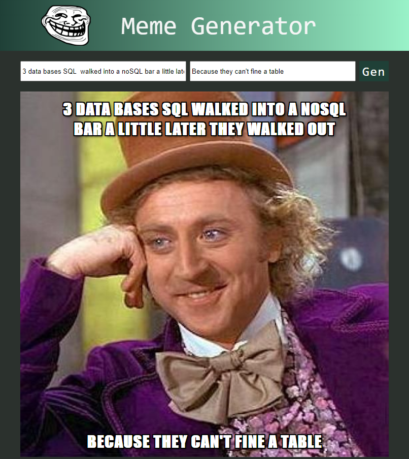

# Meme-generator
## meme-generator with react

Additional description about the project and its features.

## Built With

- HTML,
- CSS,
- REACT
- API (imgflip)
## Live Demo

[Live Demo Link](https://memegenerator2.herokuapp.com/)

## Getting Started

**Navigation bar**
- Go to (https://memegenerator2.herokuapp.com/) and have a look around. 

**Terminal**
- cd into the repo folder. 
- npm start

In this project:
- Using publiC API (imgflip)
- Diferent react component for every element on the app
- HTML and CSS.

To get a local copy  and to set it up and running follow these simple example steps.

### Prerequisites

- Browser
- Internet
- Download the code from repository (https://github.com/Alexoid1/Meme-generatorn)

## Author

👤 **Pablo Alexis Zambrano Coral**

- Github: [@Alexoid1](https://github.com/Alexoid1)
- Twitter: [@pablo_acz](https://twitter.com/pablo_acz)
- Linkedin: [linkedin](https://www.linkedin.com/in/pablo-alexis-zambrano-coral-7a614a189/)

## Show your support

Give a ⭐️ if you like this project!

## Acknowledgments

- Hat tip to anyone whose code was used
- Inspiration
- etc

## 📝 License

This project is [MIT](LICENSE) licensed.# design-teardown
